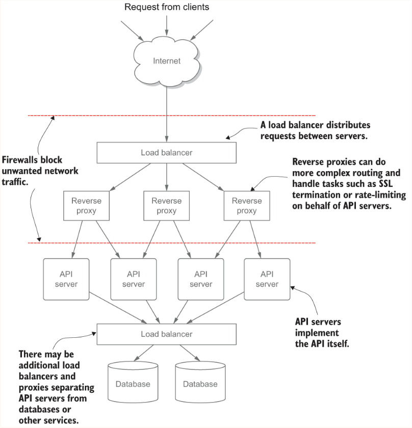
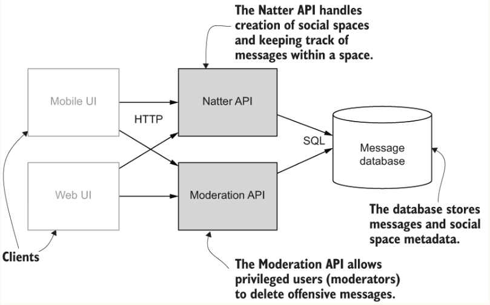

# API Security in Action
[API Security in Action](https://learning.oreilly.com/library/view/api-security-in/9781617296024/) teaches you how to create secure APIs for any situation. 
By following this hands-on guide you’ll build a social network API while mastering 
techniques for flexible multi-user security, cloud key management, and lightweight cryptography.
When you’re done, you’ll be able to create APIs that stand up to complex threat models and 
hostile environments.

## The Natter API
Natter --the social network for coffee mornings, book groups, and other small gatherings. 
You’ve defined your minimum viable product, somehow received some funding, and now need 
to put together an API and a simple web client. You’ll soon be the new Mark Zuckerberg, 
rich beyond your dreams, and considering a run for president

### Overview of the Natter API
The Natter API is split into two REST endpoints, one for normal users and one for moderators who have special 
privileges to tackle abusive behavior. Interactions between users are built around a concept of social spaces, 
which are invite-only groups. Anyone can sign up and create a social space and then invite their friends to join. 
Any user in the group can post a message to the group, and it can be read by any other member of the group. 
The creator of a space becomes the first moderator of that space.

* A HTTP POST request to the `/spaces` URI creates a new social space. The user that performs this POST operation 
becomes the owner of the new space. A unique identifier for the space is returned in the response.
* Users can add messages to a social space by sending a POST request to `/spaces/<spaceId>/messages` where `<spaceId>`
is the unique identifier of the space
* The messages in a space can be queried using a GET request to `/spaces/<spaceId>/messages`. 
A `since=<timestamp>` query parameter can be used to limit the messages returned to a recent period.
* Finally, the details of individual messages can be obtained using a GET request to `/spaces/<spaceId>/messages/<messageId>`

## Prerequisites

The following are needed to run the code examples:

- Java 11 or later. See https://adoptopenjdk.net for installers.
- A recent version of [Apache Maven](https://maven.apache.org) - I use 3.6.1.
- For testing, [curl](https://curl.haxx.se). On Mac OS X you should install
  a version of curl linked against OpenSSL rather than Secure Transport, otherwise
  you may need to adjust the examples in the book.
- I highly recommend installing [mkcert](https://github.com/FiloSottile/mkcert)
  for working with SSL certificates from chapter 3 onwards.

The API server for each chapter can be started using the command

    mvn clean compile exec:java

This will start the Spark/Jetty server running on port 4567. See chapter
descriptions for HTTP requests that can be used.

## Chapters
  
- [1 - Secure API development](chapter_01_natter_api)
  - SQL injection
  - XSS attacks
- [2 - Basic Authentication/Authorization](chapter_02_securing_api)
  - Rate limiting
  - Effective password Authentication using Scrypt
  - Encryption to keep data private (TLS)
  - Audit logging
  - Access control
- [3 - Session cookie authentication](chapter_03_session_cookie_auth)
  - Token-based authentication
  - Using session cookies
  - Preventing cross-site request forgery attacks
- [4 - Moder token-based authentication](chapter_04_modern_token_auth)
  - Supporting cross-domain web clients with CORS
  - Storing tokens using the Web Storage API
  - The standard Bearer HTTP authentication scheme for tokens
  - Hardening database token storage
- [5 - Self-contained tokens and JWTs](chapter_05_self_contained_tokens)
  - Scaling token-based authentication with encrypted client-side storage
  - Protecting tokens with MACs and authenticated encryption
  - Generating standard JSON Web Tokens
  - Handling token revocation when all the state is on the client
- [6 - OAuth2 and OpenID connect](chapter_06_oauth2)
  - Enabling third-party access to your API with scoped tokens
  - Integrating an OAuth2 Authorization Server for delegated authorization
  - Validating OAuth2 access tokens with token introspection
  - Implementing single sign-on with OAuth and OpenID Connect
- [7 - Identity-based access control](chapter_07_rbac_and_abac)
  - Simplifying permissions with role-based access control
  - Implementing more complex policies with attribute-based access control
  - Centralizing policy management with a policy engine
    
## The OWASP Top 10
The OWASP Top 10 is a listing of the top 10 vulnerabilities found in many web applications and is considered 
the authoritative baseline for a secure web application. Produced by the Open Web Application Security Project (OWASP) 
every few years, the latest edition was published in 2017 and is available from https://owasp.org/www-project-top-ten/

| Web application top 10                                | API security top 10                             |
|-------------------------------------------------------|-------------------------------------------------|
| A1:2017 - Injection                                   | API1:2019 - Broken Object Level Authorization   |
| A2:2017 - Broken Authentication                       | API2:2019 - Broken User Authentication          |
| A3:2017 - Sensitive Data Exposure                     | API3:2019 - Excessive Data Exposure             |
| A4:2017 - XML External Entities (XXE)                 | API4:2019 - Lack of Resources & Rate Limiting   |
| A5:2017 - Broken Access Control                       | API5:2019 - Broken Function Level Authorization |
| A6:2017 - Security Misconfiguration                   | API6:2019 - Mass Assignment                     |
| A7:2017 - Cross-Site Scripting (XSS)                  | API7:2019 - Security Misconfiguration           |
| A8:2017 - Insecure Deserialization                    | API8:2019 - Injection                           |
| A9:2017 - Using Components with Known Vulnerabilities | API9:2019 - Improper Assets Management          |
| A10:2017 - Insufficient Logging & Monitoring          | API10:2019 - Insufficient Logging & Monitoring  |
