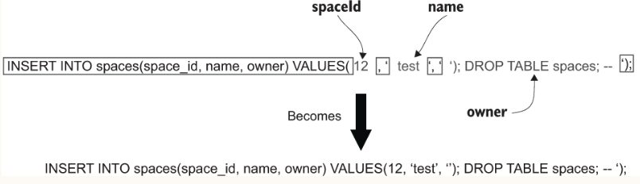

## Trying it out
The simplest way to get up and running is by opening a terminal in the project folder and using Maven:
```sh
mvn clean compile exec:java
```
You should see log output to indicate that Spark has started an embedded Jetty server on port 4567. 
You can then use curl to call your API operation, as in the following example:
```sh
$ curl -i -d '{"name": "test space", "owner": "demo"}' http://localhost:4567/spaces 
```

### SQL Injection
If we perform queries by concatenating user input directly into a string, e.g.
```
database.update("INSERT INTO spaces(space_id, name, owner) VALUES("spaceId", '"spaceName"', '"owner"')")
```
The `spaceId` is a numeric value that is created by your application from a sequence, so that is relatively safe, 
but the other two variables come directly from the user.  In this case, the input comes from the JSON payload, 
but it could equally come from query parameters in the URL itself. All types of requests are potentially vulnerable 
to injection attacks, not just POST methods that include a payload.  

In SQL, string values are surrounded by single quotes and you can see that the code takes care to add these around 
the user input. But what happens if that user input itself contains a single quote? Let’s try it and see:
```
$ curl -i -d "{\"name\": \"test'space\", \"owner\": \"demo\"}" http://localhost:4567/spaces 
HTTP/1.1 500 Server Error

{"error":"internal server error"}
```
The single quote you included in your input has ended up causing a syntax error in the SQL expression. 
What the database sees is the string 'test', followed by some extra characters (“space”) and then another single quote.

What if your input ends up being valid SQL?
```
$ curl -i -d "{\"name\": \"test\",\"owner\": \"'); DROP TABLE spaces; --\"}" http://localhost:4567/spaces
HTTP/1.1 201 Created

{"name":"', ''); DROP TABLE spaces; --","uri":"/spaces/9"}
```



### Preventing injection attacks
1. strictly validate all inputs to ensure that they only contain characters that you know to be safe
```
 var spaceName = json.getString("name");
 if (spaceName.length() > 255) {
     throw new IllegalArgumentException("space name too long");
 }
 
 var owner = json.getString("owner");
 if (!owner.matches("[a-zA-Z][a-zA-Z0-9]{1,29}")) {
     throw new IllegalArgumentException("invalid username");
 }
```
2. Prepared statements
```
database.update("INSERT INTO spaces(space_id, name, owner) VALUES(?, ?, ?);", spaceId, spaceName, owner);
```
3. Mitigating SQL injection with permissions
```
CREATE USER natter_api_user PASSWORD 'password';               
GRANT SELECT, INSERT ON spaces, messages TO natter_api_user;
```

## Input validation
Insecure deserialization
  
Although Java is a memory-safe language and so less prone to buffer overflow attacks, that does not mean it is immune 
from RCE attacks. Some serialization libraries that convert arbitrary Java objects to and from string or binary formats 
have turned out to be vulnerable to RCE attacks, known as an insecure deserialization vulnerability in the OWASP Top 10. 
This affects Java’s built-in Serializable framework, but also parsers for supposedly safe formats like JSON have been 
vulnerable, such as the popular Jackson Databind. The problem occurs because Java will execute code within the default 
constructor of any object being deserialized by these frameworks.
  
Some classes included with popular Java libraries perform dangerous operations in their constructors, including 
reading and writing files and performing other actions. Some classes can even be used to load and execute 
attacker-supplied bytecode directly. Attackers can exploit this behavior by sending a carefully crafted message that 
causes the vulnerable class to be loaded and executed.
  
##  Producing safe output