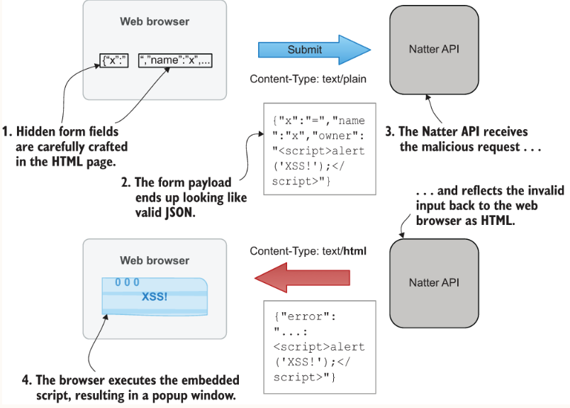

## Trying it out
The simplest way to get up and running is by opening a terminal in the project folder and using Maven:
```sh
mvn clean compile exec:java
```
You should see log output to indicate that Spark has started an embedded Jetty server on port 4567. 
You can then use curl to call your API operation, as in the following example:
```sh
$ curl -i -d '{"name": "test space", "owner": "demo"}' http://localhost:4567/spaces 
```

### SQL Injection
If we perform queries by concatenating user input directly into a string, e.g.
```
database.update("INSERT INTO spaces(space_id, name, owner) VALUES("spaceId", '"spaceName"', '"owner"')")
```
The `spaceId` is a numeric value that is created by your application from a sequence, so that is relatively safe, 
but the other two variables come directly from the user.  In this case, the input comes from the JSON payload, 
but it could equally come from query parameters in the URL itself. All types of requests are potentially vulnerable 
to injection attacks, not just POST methods that include a payload.  

In SQL, string values are surrounded by single quotes and you can see that the code takes care to add these around 
the user input. But what happens if that user input itself contains a single quote? Let’s try it and see:
```
$ curl -i -d "{\"name\": \"test'space\", \"owner\": \"demo\"}" http://localhost:4567/spaces 
HTTP/1.1 500 Server Error

{"error":"internal server error"}
```
The single quote you included in your input has ended up causing a syntax error in the SQL expression. 
What the database sees is the string 'test', followed by some extra characters (“space”) and then another single quote.

What if your input ends up being valid SQL?
```
$ curl -i -d "{\"name\": \"test\",\"owner\": \"'); DROP TABLE spaces; --\"}" http://localhost:4567/spaces
HTTP/1.1 201 Created

{"name":"', ''); DROP TABLE spaces; --","uri":"/spaces/9"}
```


### Preventing injection attacks
1. strictly validate all inputs to ensure that they only contain characters that you know to be safe
```
 var spaceName = json.getString("name");
 if (spaceName.length() > 255) {
     throw new IllegalArgumentException("space name too long");
 }
 
 var owner = json.getString("owner");
 if (!owner.matches("[a-zA-Z][a-zA-Z0-9]{1,29}")) {
     throw new IllegalArgumentException("invalid username");
 }
```
2. Prepared statements
```
database.update("INSERT INTO spaces(space_id, name, owner) VALUES(?, ?, ?);", spaceId, spaceName, owner);
```
3. Mitigating SQL injection with permissions
```
CREATE USER natter_api_user PASSWORD 'password';               
GRANT SELECT, INSERT ON spaces, messages TO natter_api_user;
```

## Input validation
Insecure deserialization
  
Although Java is a memory-safe language and so less prone to buffer overflow attacks, that does not mean it is immune 
from RCE attacks. Some serialization libraries that convert arbitrary Java objects to and from string or binary formats 
have turned out to be vulnerable to RCE attacks, known as an insecure deserialization vulnerability in the OWASP Top 10. 
This affects Java’s built-in Serializable framework, but also parsers for supposedly safe formats like JSON have been 
vulnerable, such as the popular Jackson Databind. The problem occurs because Java will execute code within the default 
constructor of any object being deserialized by these frameworks.
  
Some classes included with popular Java libraries perform dangerous operations in their constructors, including 
reading and writing files and performing other actions. Some classes can even be used to load and execute 
attacker-supplied bytecode directly. Attackers can exploit this behavior by sending a carefully crafted message that 
causes the vulnerable class to be loaded and executed.
  
##  Cross-site scripting/XSS
Cross-site scripting, or XSS, is a common vulnerability affecting web applications, in which an attacker can cause a 
script to execute in the context of another site. In a persistent XSS, the script is stored in data on the server and 
then executed whenever a user accesses that data through the web application. A reflected XSS occurs when a maliciously 
crafted input to a request causes the script to be included (reflected) in the response to that request. Reflected XSS 
is slightly harder to exploit because a victim has to be tricked into visiting a website under the attacker’s control 
to trigger the attack. A third type of XSS, known as DOM-based XSS, attacks JavaScript code that dynamically 
creates HTML in the browser.
  
These can be devastating to the security of a web application, allowing an attacker to potentially steal session cookies 
and other credentials, and to read and alter data in that session. To appreciate why XSS is such a risk, you need to 
understand that the security model of web browsers is based on the same-origin policy (SOP). Scripts executing within 
the same origin (or same site) as a web page are, by default, able to read cookies set by that website, examine HTML 
elements created by that site, make network requests to that site, and so on, although scripts from other origins are 
blocked from doing those things. A successful XSS allows an attacker to execute their script as if it came from the 
target origin, so the malicious script gets to do all the same things that the genuine scripts from that origin can do. 
If I can successfully exploit an XSS vulnerability on facebook.com, for example, my script could potentially read and 
alter your Facebook posts or steal your private message
  
See the `xss.html` code - once the page loads, it automatically submits the form which contains a script using JavaScript.
Because the error response was served with the default Content-Type of `text/html`, the browser happily interprets 
the response as HTML and executes the script, resulting in the XSS popup
  


Use the following branch to reproduce:  
- [no_xss_protection branch](https://github.com/Gelerion/security-in-action-natter-api/tree/no_xss_protection/chapter_01_natter_api)

### Preventing XSS
- Be strict in what you accept. If your API consumes JSON input, then require that all requests include a `Content-Type`
header set to `application/json`. This prevents the form submission tricks that you used in this example, as an HTML form 
cannot submit `application/json` content.
- Ensure all outputs are well-formed using a proper JSON library rather than by concatenating strings.
- Produce correct `Content-Type` headers on all your API’s responses, and never assume the defaults are sensible. 
Check error responses in particular, as these are often configured to produce HTML by default.
- If you parse the `Accept` header to decide what kind of output to produce, never simply copy the value of that 
header into the response. Always explicitly specify the Content-Type that your API has produced.
  
Additionally, there are some standard security headers that you can add to all API responses to add additional protection
for web browser clients
```
 response.header("X-Content-Type-Options", "nosniff");
 response.header("X-Frame-Options", "DENY");
 response.header("X-XSS-Protection", "0");
 response.header("Cache-Control", "no-store");
 response.header("Content-Security-Policy", "default-src 'none'; frame-ancestors 'none'; sandbox");
```