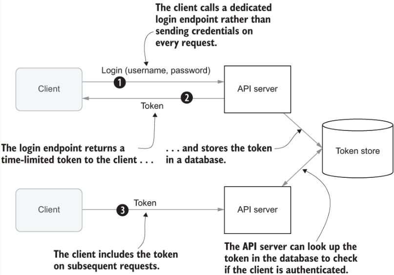
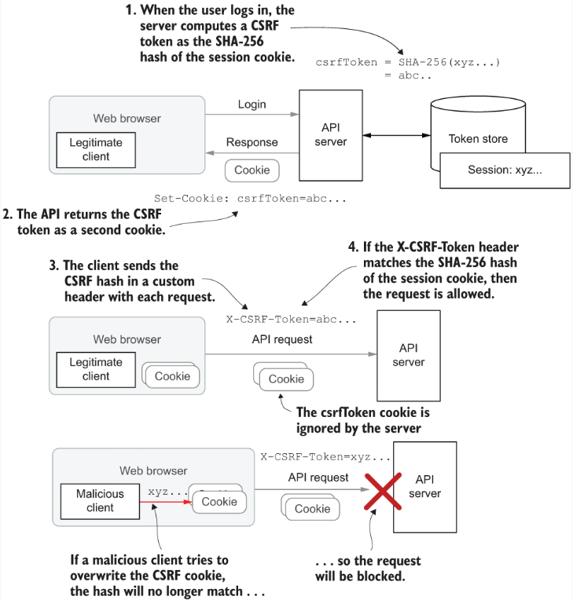

## Trying it out
The simplest way to get up and running is by opening a terminal in the project folder and using Maven:
```sh
mvn clean compile exec:java -pl chapter_03_session_cookie_auth
```
You should see log output to indicate that Spark has started an embedded Jetty server on port 4567.
You can access the UI from:
```
https://localhost:4567/natter.html
```

### Drawbacks of HTTP authentication
- The user’s password is sent on every API call, increasing the chance of it accidentally being exposed by a bug in one of those operations
- Verifying a password is an expensive operation, and performing this validation on every API call adds a lot of overhead. Modern password-hashing algorithms are designed to take around 100ms for interactive logins, which limits your API to handling 10 operations per CPU core per second
- The dialog box presented by browsers for HTTP Basic authentication is pretty ugly, with not much scope for customization. 
- There is no obvious way for the user to ask the browser to forget the password. Even closing the browser window may not work, and it often requires configuring advanced settings or completely restarting the browser. On a public terminal, this is a serious security problem if the next user can visit pages using your stored password just by clicking the Back button

#### Same-origin policy
By default, browsers allow JavaScript to send HTTP requests only to a server on the same origin that the script was 
loaded from. This is known as the same-origin policy (SOP) and is an important cornerstone of web browser security.

The same-origin policy (SOP) is applied by web browsers to decide whether to allow a page or script loaded from one 
origin to interact with other resources. It applies when other resources are embedded within a page, such as 
by HTML `` or `<script>` tags, and when network requests are made through form submissions or by JavaScript. 
Requests to the same origin are always allowed, but requests to a different origin, known as cross-origin requests, 
are often blocked based on the policy. Many browser APIs available to JavaScript are also restricted by origin, such 
as access to the HTML document itself (via the document object model, or DOM), local data storage, and cookies. 

#### Instructing Spark to serve our HTML and JS files
To instruct Spark to serve your HTML and JavaScript files, you add a `staticFiles` directive to the main method where 
you have configured the API routes.
```
Spark.staticFiles.location("/public");
```
Once you have configured Spark and restarted the API server, you will be able to access the UI 
from `https://localhost:4567/natter.html`
Chrome prompt for `username` and `password` produced automatically when the API asks for HTTP `Basic authentication`.

So, where did this come from? Because your JavaScript client did not supply a username and password on the 
REST API request, the API responded with a standard HTTP 401 Unauthorized status and a WWW-Authenticate header prompting 
for authentication using the Basic scheme. The browser understands the Basic authentication scheme, so it pops up a 
dialog box automatically to prompt the user for a username and password.

### Cookie-based Token authentication
You want is a way for users to login once and then be trusted for the next hour or so while they use the API. 
This is the purpose of token-based authentication, and in the form of session cookies.

When a user logs in by presenting their username and password, the API will generate a random string (the token) and 
give it to the client. The client then presents the token on each subsequent request, and the API can look up the token 
in a database on the server to see which user is associated with that session. When the user logs out, or the token 
expires, it is deleted from the database, and the user must log in again if they want to keep using the API



Cookies are a great choice for first-party clients running on the same origin as the API they are talking to but can 
be difficult when dealing with third-party clients and clients hosted on other domains.

#### Session cookies
After the user authenticates, the login endpoint returns a Set-Cookie header on the response that instructs 
the web browser to store a random session token in the cookie storage. Subsequent requests to the same site will 
include the token as a Cookie header. The server can then look up the cookie token in a database to see which user 
is associated with that toke

#### Try it out
- create a test user
```sh
curl --cacert "$(mkcert -CAROOT)/rootCA.pem" -H 'Content-Type: application/json' -d '{"username":"test","password":"password"}' https://localhost:4567/users
#=> {"username":"test"}
```
- call the new `/sessions` endpoint, passing in the username and password using HTTP Basic authentication to get a new session cookie
```sh
curl --cacert "$(mkcert -CAROOT)/rootCA.pem" -i -u test:password -H 'Content-Type: application/json' -X POST https://localhost:4567/sessions
#=> Set-Cookie: JSESSIONID=node0hwk7s0nq6wvppqh0wbs0cha91.node0;Path=/;Secure;HttpOnly
#=> {"token":"node0hwk7s0nq6wvppqh0wbs0cha91"}
```

### Cookie security attributes

| Cookie attribute     | Meaning                                                                                                                                                                                                                                                                                                                                                                                             |
|----------------------|-----------------------------------------------------------------------------------------------------------------------------------------------------------------------------------------------------------------------------------------------------------------------------------------------------------------------------------------------------------------------------------------------------|
| Secure               | Secure cookies are only ever sent over a HTTPS connection                                                                                                                                                                                                                                                                                                                                           |
| HttpOnly             | Cookies marked HttpOnly cannot be read by JavaScript                                                                                                                                                                                                                                                                                                                                                |
| SameSite             | Will only be sent on requests that originate from the same origin as the cookie (to prevent CSRF attacks)                                                                                                                                                                                                                                                                                           |
| Domain               | If no Domain attribute is present, then a cookie will only be sent on requests to the exact host that issued the Set-Cookie header. This is known as a host-only cookie. If you set a Domain attribute, then the cookie will be sent on requests to that domain and all sub-domains. For example, a cookie with Domain=example.com will be sent on requests to api.example.com and www .example.com | 
| Path                 | If the Path attribute is set to `/users`, then the cookie will be sent on any request to a URL that matches `/users` or any sub-path such as `/users/mary`, but not on a request to `/cats/mrmistoffelee`                                                                                                                                                                                           |
| Expires and Max-Age  | Sets the time at which the cookie expires and should be forgotten by the client, either as an explicit date and time (Expires) or as the number of seconds from now (Max-Age)                                                                                                                                                                                                                       |

#### Persistent cookies
A cookie with an explicit Expires or Max-Age attribute is known as a persistent cookie and will be permanently 
stored by the browser until the expiry time is reached, even if the browser is restarted. Cookies without these 
attributes are known as session cookies (even if they have nothing to do with a session token) and are deleted 
when the browser window or tab is closed. You should avoid adding the Max-Age or Expires attributes to your 
authentication session cookies so that the user is effectively logged out when they close their browser tab

#### Making requests using a session cookie instead of using HTTP Basic on every request
reproducable on: `cookie-toknes-branch`
  
- create a test user
```sh
curl --cacert "$(mkcert -CAROOT)/rootCA.pem" -H 'Content-Type: application/json' -d '{"username":"test","password":"password"}' https://localhost:4567/users
```
-  the `-c` option to save cookies from the response to a file
```sh
curl --cacert "$(mkcert -CAROOT)/rootCA.pem" -i -c /tmp/cookies -u test:password -H 'Content-Type: application/json' -X POST https://localhost:4567/sessions
```
- make a call to an API endpoint
```sh
curl --cacert "$(mkcert -CAROOT)/rootCA.pem" -b /tmp/cookies -H 'Content-Type: application/json' -d '{"name":"test space","owner":"test"}' https://localhost:4567/spaces
```
  
### Defense against CSRF attacks
The most effective defense against CSRF attacks is to require that the caller prove that they know the session cookie, 
or some other unguessable value associated with the session. A common pattern for preventing CSRF in traditional 
web applications is to generate a random string and store it as an attribute on the session. Whenever the application 
generates an HTML form, it includes the random token as a hidden field. When the form is submitted, the server checks 
that the form data contains this hidden field and that the value matches the value stored in the session associated 
with the cookie. Any form data that is received without the hidden field is rejected. This effectively prevents 
CSRF attacks because an attacker cannot guess the random fields and so cannot forge a correct request.

>**_NOTE:_**  A double-submit cookie is a cookie that must also be sent as a custom header on every request. 
> As cross-origin scripts are not able to read the value of the cookie, they cannot create the custom header value, 
> so this is an effective defense against CSRF attacks



This traditional solution has some problems, because although it is not possible to read the value of the second cookie 
from another origin, there are several ways that the cookie could be overwritten by the attacker with a known value, 
which would then let them forge requests. 

Rather than generating a second random cookie, you will run the original session cookie through a cryptographically 
secure hash function to generate the second token. This ensures that any attempt to change either the anti-CSRF token 
or the session cookie will be detected because the hash of the session cookie will no longer match the token. Because 
the attacker cannot read the session cookie, they are unable to compute the correct hash value.

#### Timing attacks
A timing attack works by measuring tiny differences in the time it takes a computer to process different inputs to 
work out some information about a secret value that the attacker does not know.

Consider what would happen if you used the normal String equals method to compare the hash of the session ID with the 
anti-CSRF token received in a header. In most programming languages, including Java, string equality is implemented 
with a loop that terminates as soon as the first non-matching character is found. This means that the code takes very 
slightly longer to match if the first two characters match than if only a single character matches. A sophisticated 
attacker can measure even this tiny difference in timing. They can then simply keep sending guesses for 
the anti-CSRF token.

The solution to such timing attacks is to ensure that all code that performs comparisons or lookups using secret values 
take a constant amount of time regardless of the value of the user input that is supplied. (e.g. `MessageDigest.isEqual`)

#### Trying it out
Use the above requests but with the `-H 'X-CSRF-Token: XXX` header