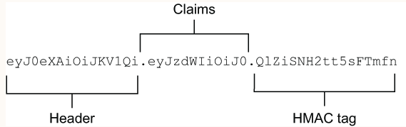

## Overview
The token database is struggling to cope with this level of traffic. You’ve evaluated different database backends, 
but you’ve heard about stateless tokens that would allow you to get rid of the database entirely. Without a database 
slowing you down, Natter will be able to scale up as the user base continues to grow. You’ll implement self-contained 
tokens securely, and examine some of the security trade-offs compared to database-backed tokens. You’ll also learn 
about the JSON Web Token (JWT) standard that is the most widely used token format today.

### Storing token state on the client
The idea behind stateless tokens is simple. Rather than store the token state in the database, you can instead encode 
that state directly into the token ID and send it to the client. For example, you could serialize the token fields 
into a JSON object, which you then Base64url-encode to create a string that you can use as the token ID. When the token 
is presented back to the API, you then simply decode the token and parse the JSON to recover the attributes 
of the session.
  
see [JsonTokenStore](src/main/java/com/gelerion/security/in/action/token/JsonTokenStore.java)

##### Protecting JSON tokens with HMAC
Anybody can log in to the API and then edit the encoded token in their browser to change their username 
or other security attributes! In fact, they can just create a brand-new token themselves without ever 
logging in. You can fix that by reusing the `HmacTokenStore`
  
```
TokenStore tokenStore = new JsonTokenStore();
tokenStore = new HmacTokenStore(tokenStore, macKey);
var tokenController = new TokenController(tokenStore);
```

### JSON Web Tokens
JWTs are very similar to the JSON tokens you have just produced, but have many more features:
- A standard header format that contains metadata about the JWT, such as which MAC or encryption algorithm was used
- A set of standard claims that can be used in the JSON content of the JWT, with defined meanings, such as `exp` to indicate the expiry time and `sub` for the subject, just as you have been using
- A wide range of algorithms for authentication and encryption, as well as digital signatures and public key encryption

A basic authenticated JWT is almost exactly like the HMAC-authenticated JSON tokens, but with an additional JSON header 
that indicates the algorithm and other details of how the JWT was produced
  


#### The standard JWT claims

| Claim | Name       | Purpose                                                                                                                                                                                                                                                                     |
|-------|------------|-----------------------------------------------------------------------------------------------------------------------------------------------------------------------------------------------------------------------------------------------------------------------------|
| iss   | Issuer     | Indicates who created the JWT. This is a single string and often the URI of the authentication service                                                                                                                                                                      |
| aud   | Audience   | Indicates who the JWT is for. An array of strings identifying the intended recipients of the JWT. If there is only a single value, then it can be a simple string value rather than an array. The recipient of a JWT must check that its identifier appears in the audience |
| iat   | Issued-At  | The UNIX time at which the JWT was created                                                                                                                                                                                                                                  |
| nbf   | Not-Before | The JWT should be rejected if used before this time                                                                                                                                                                                                                         |
| exp   | Expiry     | The UNIX time at which the JWT expires and should be rejected by recipients                                                                                                                                                                                                 |
| sub   | Subject    | The identity of the subject of the JWT. A string. Usually a username or other unique identifier                                                                                                                                                                             |
| jti   | JWT ID     | A unique ID for the JWT, which can be used to detect replay                                                                                                                                                                                                                 |

Of these claims, only the issuer, issued-at, and subject claims express a positive statement. The remaining fields all 
describe constraints on how the token can be used rather than making a claim. These constraints are intended to prevent 
certain kinds of attacks against security tokens, such as replay attacks in which a token sent by a genuine party to a 
service to gain access is captured by an attacker and later replayed so that the attacker can gain access. Setting a 
short expiry time can reduce the window of opportunity for such attacks, but not eliminate them. The JWT ID can be used 
to add a unique value to a JWT, which the recipient can then remember until the token expires to prevent the same token 
being replayed

### Header
Most of the flexibility of the JOSE and JWT standards is concentrated in the header, which is an additional JSON object 
that is included in the authentication tag and contains metadata about the JWT.
```json
{
  "alg": "HS256",
  "kid": "hmac-key-1"
}
```
Although seemingly innocuous, the JOSE header is one of the more error-prone aspects of the specifications, which is why 
the code you have written so far does not generate a header, and I often recommend that they are stripped when possible 
to create (nonstandard) headless JWTs. This can be done by removing the header section produced by a standard JWT library 
before sending it and then recreating it again before validating a received JWT.

A better solution is to store the algorithm as metadata associated with a key on the server. You can then change the 
algorithm when you change the key, a methodology I refer to as key-driven cryptographic agility. This is much safer 
than recording the algorithm in the message, because an attacker has no ability to change the keys stored on your server.
```json
{ 
    "kty": "oct",
    "alg": "HS256",
    "k": "9ITYj4mt-TLYT2b_vnAyCVurks1r2uzCLw7sOxg-75g"
}
```
### Generating standard JWTs
For this chapter, you can use Nimbus JOSE + JWT from https://connect2id.com/products/nimbus-jose-jwt, which is a 
well-maintained open source (Apache 2.0 licensed) Java JOSE library.
```xml
<dependency>
  <groupId>com.nimbusds</groupId>
  <artifactId>nimbus-jose-jwt</artifactId>
  <version>8.19</version>
</dependency>
```
see: [SignedJwtTokenStore.java](src/main/java/com/gelerion/security/in/action/token/SignedJwtTokenStore.java)


#### Trying it out
- create a test user
```sh
curl -i --cacert "$(mkcert -CAROOT)/rootCA.pem" -H 'Content-Type: application/json' -d '{"username":"test","password":"password"}' https://localhost:4567/users
```
- create a token
```sh
curl -i --cacert "$(mkcert -CAROOT)/rootCA.pem" -u test:password -H 'Content-Type: application/json' -X POST https://localhost:4567/sessions
```
- use token to create spaces
```sh
curl -i --cacert "$(mkcert -CAROOT)/rootCA.pem" -H 'Authorization: Bearer {TOKEN}' -H 'Content-Type: application/json' -d '{"owner":"test","name":"test space"}' https://localhost:4567/spaces
```
  
You can take the token we get in the response and paste it into the debugger at https://jwt.io to validate it and see 
the contents of the header and claim

### Encrypting sensitive attributes
Once you move away from a database and start storing data on the client, that data is much more vulnerable to snooping. 
Any personal information about the user included in the token, such as name, date of birth, job role, work location, 
and so on, may be at risk if the token is accidentally leaked by the client or stolen though a phishing attack or 
XSS exfiltration.

The goal of encryption is to ensure the confidentiality of a message by converting it into an obscured form, 
known as the `ciphertext`, using a `secret key`. The recipient can then use the same secret key to recover the original 
plaintext message. When the sender and recipient both use the same key, this is known as secret key cryptography. 
There are also public key encryption algorithms in which the sender and recipient have different keys.

Many encryption algorithms only ensure the confidentiality of data that has been encrypted and don’t claim to protect 
the integrity of that data. This means that an attacker won’t be able to read any sensitive attributes in an encrypted 
token, but they may be able to alter them. To protect against spoofing and tampering threats, you should always 
use algorithms that provide authenticated encryption. Authenticated encryption algorithms combine an encryption 
algorithm for hiding sensitive data with a MAC algorithm, such as HMAC, to ensure that the data can’t be altered or faked.
  
#### Authenticated encryption with NaCl
The most well-known of these is the Networking and Cryptography Library
```xml
<dependency>
  <groupId>software.pando.crypto</groupId>
  <artifactId>salty-coffee</artifactId>
  <version>1.1.1</version>
</dependency>
```

see: [EncryptedTokenStore.java](src/main/java/com/gelerion/security/in/action/token/encrypted/EncryptedTokenStore.java)

#### Generating encryption key
```sh
keytool -genseckey -keyalg AES -keysize 256 -alias aes-key -keystore keystore.p12 -storepass changeit
```

### More on the best practice design
https://learning.oreilly.com/library/view/api-security-in/9781617296024/OEBPS/Text/06.htm#heading_id_15