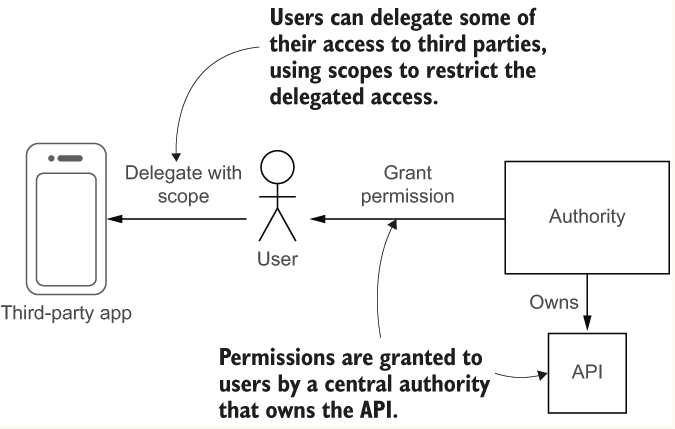
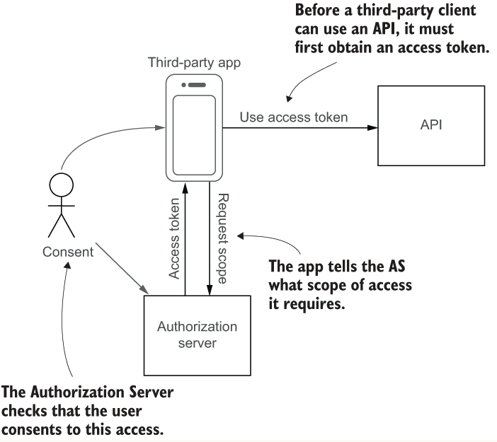
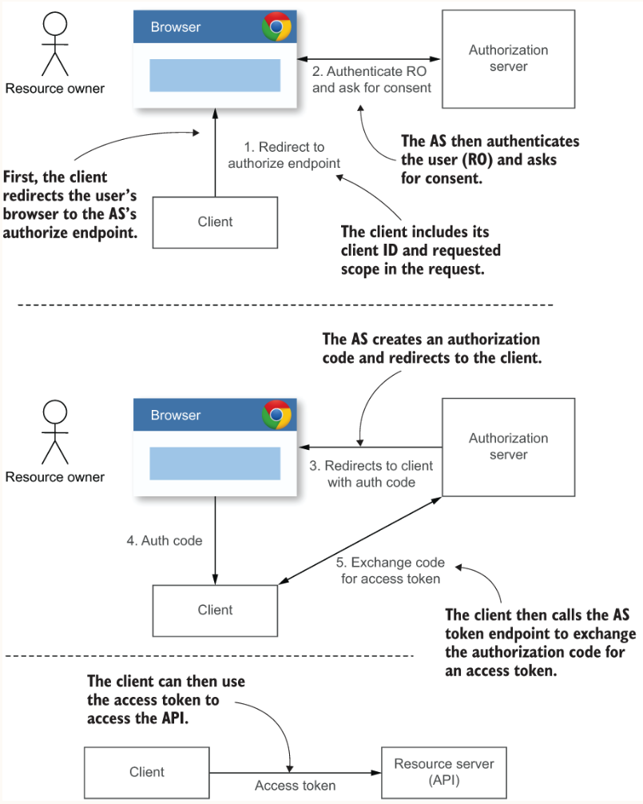
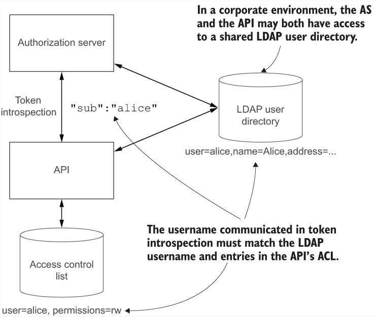
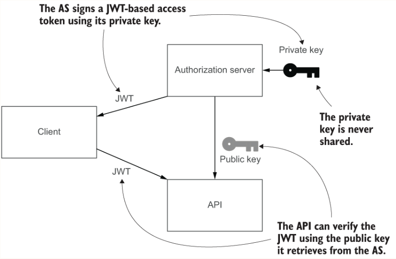
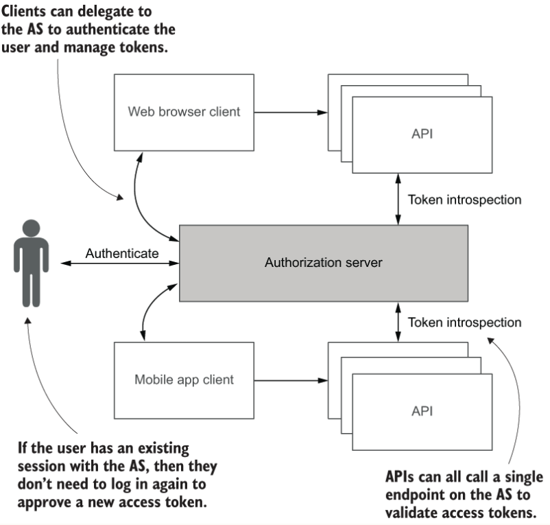

## Overview
In this chapter, you'll integrate an OAuth2 Authorization Server (AS) to allow your users to delegate access to 
third-party clients. By using scoped tokens, users can restrict which parts of the API those clients can access. 
Finally, you’ll see how OAuth provides a standard way to centralize token-based authentication within your organization 
to achieve single sign-on across different APIs and services.
  
The OpenID Connect standard builds on top of OAuth2 to provide a more complete authentication framework when you need 
finer control over how a user is authenticated.

### Scoped tokens
If you wanted to use a third-party app or service to access your email or bank account, you had little choice but to 
give them your username and password and hope they didn't misuse them. Token-based authentication provides a solution 
to this problem by allowing you to generate a long-lived token that you can give to the third-party service instead of 
your password. The service can then use the token to act on your behalf.

Using a token means that you don’t need to give the third-party your password, the tokens you’ve used so far still grant 
full access to APIs as if you were performing actions yourself. The third-party service can use the token to do anything 
that you can do. But you may not trust a third-party to have full access, and only want to grant them partial access.
  


#### Adding scoped tokens to Natter
Define a default set of scopes to grant if the scope parameter is not specified, see TokenController
```
private static final String DEFAULT_SCOPES =
    "create_space post_message read_message list_messages delete_message add_member";
```
  
>**_WARNING_** There is a potential privilege escalation issue to be aware of in this code. A client that is given a 
> scoped token can call this endpoint to exchange it for one with more scopes

```
public JSONObject login(Request request, Response response) {
    var token = new TokenStore.Token(expiry, subject);
    var scope = request.queryParamOrDefault("scope", DEFAULT_SCOPES);   
    token.attributes.put("scope", scope);                              
    var tokenId = tokenStore.create(request, token);
}
```
To enforce the scope restrictions on a token, you can add a new access control filter that ensures that the token used 
to authorize a request to the API has the required scope for the operation being performed.
If there is no scope attribute, then the user directly authenticated the request with Basic authentication. In this case,
you can skip the scope check and let the request proceed. Any client with access to the user’s password would be able 
to issue themselves a token with any scope
  
#### The difference between scopes and permissions
Permissions are typically granted by a central authority that owns the API being accessed. A user does not get to 
choose or change their own permissions. Scopes allow a user to delegate part of their authority to a third-party app, 
restricting how much access they grant using scopes.
  

  
### OAuth2
Although allowing your users to manually create scoped tokens for third-party applications is an improvement over 
sharing unscoped tokens or user credentials, it can be confusing and error-prone.  
A better solution is for the application to request the scopes that it requires, and then the API can ask the user 
if they consent. OAuth introduces the notion of an Authorization Server (AS), which acts as a central service for 
managing user authentication and consent and issuing tokens. This centralization provides significant advantages even 
if your API has no third-party clients, which is one reason why OAuth2 has become so popular as a standard for API security. 
The tokens that an application uses to access an API are known as access tokens in OAuth2, to distinguish them from 
other sorts of tokens
  
- The authorization server (AS) authenticates the user and issues tokens to clients.
- The user is known as the resource owner (RO), because it’s typically their resources (documents, photos, and so on) that the third-party app is trying to access. This term is not always accurate, but it has stuck now.
- The third-party app or service is known as the client.
- The API that hosts the user’s resources is known as the resource server (RS)

Before a client can ask for an access token it must first register with the AS and obtain a unique client ID. 
This can either be done manually by a system administrator, or there is a standard to allow clients to [dynamically](https://tools.ietf.org/html/rfc7591) 
register with an AS.

There are two different types of clients:
- Public clients are applications that run entirely within a user’s own device, such as a mobile app or JavaScript client running in a browser. The client is completely under the user’s control.
- Confidential clients run in a protected web server or other secure location that is not under a user’s direct control.

The main difference between the two is that a confidential client can have its own client credentials that it uses to 
authenticate to the authorization server. This ensures that an attacker cannot impersonate a legitimate client to try 
to obtain an access token from a user in a phishing attack. A mobile or browser-based application cannot keep 
credentials secret because any user that downloads the application could extract them.
  

  
### The Authorization Code grant
In the authorization code grant, the client first redirects the user’s web browser to the authorization endpoint at 
the AS. The client includes its client ID and the scope it’s requesting from the AS in this redirect. Set the 
`response_type` parameter in the query to `code` to request an authorization code (other settings such as token are 
used for the implicit grant). Finally, the client should generate a unique random state value for each request and 
store it locally (such as in a browser cookie). When the AS redirects back to the client with the authorization 
code it will include the same state parameter, and the client should check that it matches the original one sent on 
the request. This ensures that the code received by the client is the one it requested. Otherwise, an attacker may be 
able to craft a link that calls the client’s redirect endpoint directly with an authorization code obtained by the attacker.
  

  
##### Hardening code exchange with PKCE
Before the invention of claimed HTTPS redirect URIs, mobile applications using private-use URI schemes were vulnerable 
to code interception by a malicious app registering the same URI scheme, as described in the previous section. To protect 
against this attack, the OAuth working group developed the PKCE standard.

The way PKCE works for a client is quite simple. Before the client redirects the user to the authorization endpoint, it 
generates another random value, known as the PKCE code verifier. This value should be generated with high entropy, such 
as a 32-byte value from a SecureRandom object in Java; the PKCE standard requires that the encoded value is at least 43 
characters long and a maximum of 128 characters from a restricted set of characters. The client stores the code verifier 
locally, alongside the state parameter. Rather than sending this value directly to the AS, the client first hashes it 
using the SHA-256 cryptographic hash function to create a code challenge. The client then adds the code challenge as 
another query parameter when redirecting to the authorization endpoint.
```
String addPkceChallenge(Request request, String authorizeRequest) throws Exception { 
    var secureRandom = new SecureRandom();
    var encoder = Base64.getUrlEncoder().withoutPadding();
 
    var verifierBytes = new byte[32];                                 
    secureRandom.nextBytes(verifierBytes);                            
    var verifier = encoder.encodeToString(verifierBytes);             
 
    request.session(true).attribute("verifier", verifier);            
 
    var sha256 = MessageDigest.getInstance("SHA-256");  
    var challenge = encoder.encodeToString(sha256.digest(verifier.getBytes("UTF-8")));
                   
    return authorizeRequest + 
        "&code_challenge=" + challenge +                         
        "&code_challenge_method=S256";                                
}
```
Later, when the client exchanges the authorization code at the token endpoint, it sends the original (unhashed) code 
verifier in the request. The AS will check that the SHA-256 hash of the code verifier matches the code challenge that 
it received in the authorization request.
  
### Refresh tokens
In addition to an access token, the AS may also issue the client with a refresh token at the same time. When the access 
token expires, the client can then use the refresh token to obtain a fresh access token from the AS without the resource 
owner needing to approve the request again. Because the refresh token is sent only over a secure channel between the 
client and the AS, it’s considered more secure than an access token that might be sent to many different APIs.

The primary benefit of refresh tokens is to allow the use of stateless access tokens such as JWTs. If the access token 
is short-lived, then the client is forced to periodically refresh the token at the AS, providing an opportunity for the 
token to be revoked without the AS maintaining a large blocklist. The complexity of revocation is effectively pushed 
to the client, which must now handle periodically refreshing its access tokens.
  
### Validating an access token
Originally, OAuth2 didn’t provide a solution to this problem and left it up to the AS and resource servers to decide 
how to coordinate to validate tokens. This changed with the publication of the OAuth2 
[Token Introspection standard](https://tools.ietf.org/html/rfc7662) in 2015, which describes a standard HTTP endpoint 
on the AS that the RS can call to validate an access token and retrieve details about its scope and resource owner.  
Another popular solution is to use JWTs as the format for access tokens, allowing the RS to locally validate the token 
and extract required details from the embedded JSON claims.
  
#### Token introspection
To validate an access token using token introspection, you simply make a POST request to the introspection endpoint 
of the AS, passing in the access token as a parameter. The AS will usually require your API (acting as the resource server) 
to register as a special kind of client and receive client credentials to call the endpoint. The examples in this section 
will assume that the AS requires HTTP Basic authentication because this is the most common requirement, but you should 
check the documentation for your AS to determine how the RS must authenticate
  
see:
[OAuth2TokenStore](src/main/java/com/gelerion/security/in/action/token/OAuth2TokenStore.java)
  
You should make sure that the AS and the API have the same users and that the AS communicates the username to the 
API in the `sub` or `username` fields from the introspection response

  
### Securing the HTTPS client configuration
Because the API relies entirely on the AS to tell it if an access token is valid, and the scope of access it should 
grant, it’s critical that the connection between the two be secure. While this connection should always be over HTTPS, 
the default connection settings used by Java are not as secure as they could be.

#### TLS cipher suites
A TLS cipher suite is a collection of cryptographic algorithms that work together to create the secure channel between 
a client and a server. When a TLS connection is first established, the client and server perform a handshake, in which 
the server authenticates to the client, the client optionally authenticates to the server, and they agree upon a session 
key to use for subsequent messages. The cipher suite specifies the algorithms to be used for authentication, key exchange, 
and the block cipher and mode of operation to use for encrypting messages. The cipher suite to use is negotiated as 
the first part of the handshake.
  
#### Certificate chains
When configuring the trust store for your HTTPS client, you could choose to directly trust the server certificate for 
that server. Although this seems more secure, it means that whenever the server changes its certificate, the client 
would need to be updated to trust the new one. Many server certificates are valid for only 90 days. If the server is 
ever compromised, then the client will continue trusting the compromised certificate until it’s manually updated to 
remove it from the trust store.
  
To avoid these problems, the server certificate is signed by a CA, which itself has a (self-signed) certificate. 
When a client connects to the server it receives the server’s current certificate during the handshake. To verify 
this certificate is genuine, it looks up the corresponding CA certificate in the client trust store and checks that the 
server certificate was signed by that CA and is not expired or revoked.

In practice, the server certificate is often not signed directly by the CA. Instead, the CA signs certificates for one 
or more intermediate CAs, which then sign server certificates. The client may therefore have to verify a chain of 
certificates until it finds a certificate of a root CA that it trusts directly. Because CA certificates might themselves 
be revoked or expire, in general the client may have to consider multiple possible certificate chains before it finds a 
valid one. Verifying a certificate chain is complex and error-prone with many subtle details so you should always use a 
mature library to do this.
  
## JWT access tokens
Though token introspection solves the problem of how the API can determine if an access token is valid and the scope 
associated with that token, it has a downside: the API must make a call to the AS every time it needs to validate 
a token. An alternative is to use a self-contained token format such as JWTs.

To validate a JWT-based access token, the API needs to first authenticate the JWT using a cryptographic key. you used 
symmetric HMAC or authenticated encryption algorithms in which the same key is used to both create and verify messages. 
This means that any party that can verify a JWT is also able to create one that will be trusted by all other parties. 
Although this is suitable when the API and AS exist within the same trust boundary, it becomes a security risk when 
the APIs are in different trust boundaries.

To avoid these problems, the AS can switch to public key cryptography using digital signatures. Rather than having a 
single shared key, the AS instead has a pair of keys: a private key and a public key. The AS can sign a JWT using the 
private key, and then anybody with the public key can verify that the signature is genuine. However, the public key 
cannot be used to create a new signature and so it’s safe to share the public key with any API that needs to validate 
access tokens. For this reason, public key cryptography is also known as asymmetric cryptography, because the holder 
of a private key can perform different operations to the holder of a public key. 
  

  
#### Retrieving the public key
The API can be directly configured with the public key of the AS. For example, you could create a keystore that contains 
the public key, which the API can read when it first starts up. Although this will work, it has some disadvantages:
- A Java keystore can only contain certificates, not raw public keys, so the AS would need to create a self-signed certificate purely to allow the public key to be imported into the keystore. This adds complexity that would not otherwise be required.
- If the AS changes its public key, which is recommended, then the keystore will need to be manually updated to list the new public key and remove the old one. Because some access tokens using the old key may still be in use, the keystore may have to list both public keys until those old tokens expire. This means that two manual updates need to be performed: one to add the new public key, and a second update to remove the old public key when it’s no longer needed.

A common solution is for the AS to publish its public key in a JSON document known as a JWK Set. The API can periodically 
fetch the JWK Set from an HTTPS URI provided by the AS. The API can trust the public keys in the JWK Set because they 
were retrieved over HTTPS from a trusted URI, and that HTTPS connection was authenticated using the server certificate 
presented during the TLS handshake

Many JWT libraries have built-in support for retrieving keys from a JWK Set over HTTPS, including periodically refreshing them.
```
var jwkSetUri = URI.create("https://as.example.com:8443/jwks_uri");
var jwkSet = new RemoteJWKSet(jwkSetUri);
```

see:
[SignedJwtAccessTokenStore](src/main/java/com/gelerion/security/in/action/token/SignedJwtAccessTokenStore.java)

### Single sign-on
One of the advantages of OAuth2 is the ability to centralize authentication of users at the AS, providing a 
single sign-on (SSO) experience. When the user’s client needs to access an API, it redirects the user to the AS 
authorization endpoint to get an access token. At this point the AS authenticates the user and asks for consent for 
the client to be allowed access. Because this happens within a web browser, the AS typically creates a session cookie, 
so that the user does not have to login again.
  

  
### OpenID Connect
OAuth can provide basic SSO functionality, but the primary focus is on delegated third-party access to APIs rather 
than user identity or session management. The OpenID Connect (OIDC) suite of [standards](https://openid.net/developers/specs/) 
extend OAuth2 with several features:
- A standard way to retrieve identity information about a user, such as their name, email address, postal address, and telephone number. The client can access a UserInfo endpoint to retrieve identity claims as JSON using an OAuth2 access token with standard OIDC scopes.
- A way for the client to request that the user is authenticated even if they have an existing session, and to ask for them to be authenticated in a particular way, such as with two-factor authentication.
- Extensions for session management and logout, allowing clients to be notified when a user logs out of their session at the AS, enabling the user to log out of all clients at once (known as single logout)