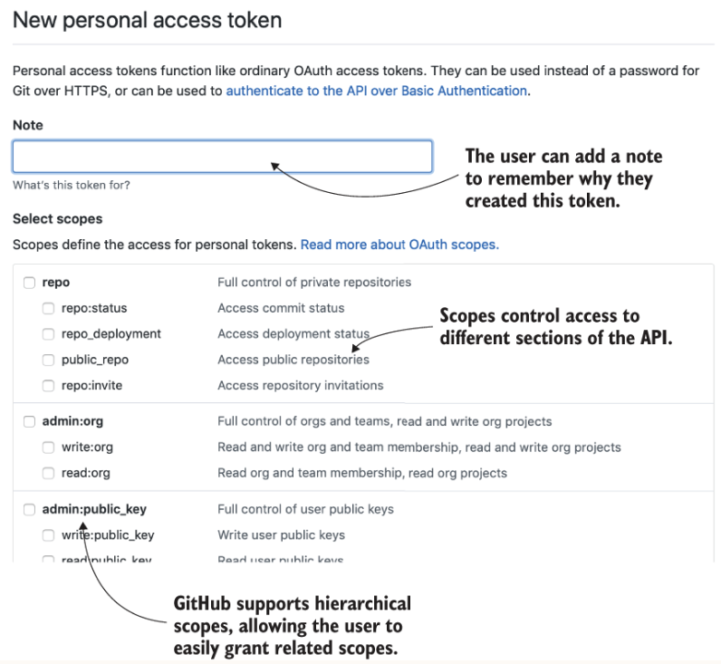

## Overview
In this chapter, you'll integrate an OAuth2 Authorization Server (AS) to allow your users to delegate access to 
third-party clients. By using scoped tokens, users can restrict which parts of the API those clients can access. 
Finally, you’ll see how OAuth provides a standard way to centralize token-based authentication within your organization 
to achieve single sign-on across different APIs and services.
  
The OpenID Connect standard builds on top of OAuth2 to provide a more complete authentication framework when you need 
finer control over how a user is authenticated.

### Scoped tokens
If you wanted to use a third-party app or service to access your email or bank account, you had little choice but to 
give them your username and password and hope they didn't misuse them. Token-based authentication provides a solution 
to this problem by allowing you to generate a long-lived token that you can give to the third-party service instead of 
your password. The service can then use the token to act on your behalf.

Using a token means that you don’t need to give the third-party your password, the tokens you’ve used so far still grant 
full access to APIs as if you were performing actions yourself. The third-party service can use the token to do anything 
that you can do. But you may not trust a third-party to have full access, and only want to grant them partial access.
  

