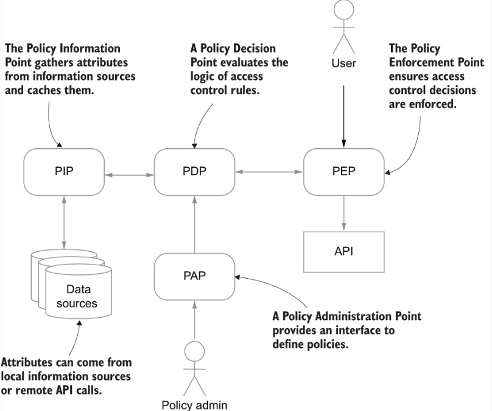

## Overview
ACLs are simple, but as the number of users and objects that can be accessed through an API grows, the number of ACL 
entries grows along with them. If you have a million users and a million objects, then in the worst case you could 
end up with a billion ACL entries listing the individual permissions of each user for each object. Though that approach 
can work with fewer users, it becomes more of a problem as the user base grows.

### LDAP groups
In many large organizations, including most companies, users are managed centrally in an LDAP (Lightweight Directory 
Access Protocol) directory. LDAP is designed for storing user information and has built-in support for groups. 
You can learn more about LDAP at https://ldap.com/basic-ldap-concepts/. 
  
### RBAC
Although groups can make managing large numbers of users simpler, they do not fully solve the difficulties of managing 
permissions for a complex API. First, almost all implementations of groups still allow permissions to be assigned to 
individual users as well as to groups. This means that to work out who has access to what, you still often need to 
examine the permissions for all users as well as the groups they belong to. Second, because groups are often used 
to organize users for a whole organization (such as in a central LDAP directory), they sometimes cannot be very 
useful distinctions for your API. For example, the LDAP directory might just have a group for all software engineers, 
but your API needs to distinguish between backend and frontend engineers, QA, and scrum masters.
  

  
### ABAC
Although RBAC is a very successful access control model that has been widely deployed, in many cases the desired access 
control policies cannot be expressed through simple role assignments.

To handle dynamic access control decisions, an alternative to RBAC has been developed known as ABAC: 
attribute-based access control. In ABAC, access control decisions are made dynamically for each API request 
using collections of attributes grouped into four categories.

When implementing ABAC, typically access control decisions are structured as a set of independent rules describing 
whether a request should be permitted or denied. If more than one rule matches a request, and they have different outcomes, 
then the question is which one should be preferred.

#### Implementing ABAC decisions
Although you could implement ABAC access control decisions directly in Java or another programming language, it’s often 
clearer if the policy is expressed in the form of rules or domain-specific language (DSL) explicitly designed to 
express access control decisions. You’ll implement a simple ABAC decision engine using the [Drools](https://drools.org) 
business rules engine from Red Hat.  
When it starts up, Drools will look for a file called `kmodule.xml` on the classpath that defines the configuration. 
  
see: [DroolsAccessController.java](src/main/java/com/gelerion/security/in/action/DroolsAccessController.java)
and rules: [accessrules.drl](src/main/resources/accessrules.drl)

Now that you have written an ABAC rule you can wire up the main method to apply your rules as a Spark `before()` filter
that runs before the other access control rules.
```
var droolsController = new DroolsAccessController();
before("/*", droolsController::enforcePolicy);
```
  
#### Policy agents and API gateways
ABAC enforcement can be complex as policies increase in complexity. Although general-purpose rule engines such as 
Drools can simplify the process of writing ABAC rules, specialized components have been developed that implement 
sophisticated policy enforcement. These components are typically implemented either as a policy agent that plugs into 
an existing application server, web server, or reverse proxy, or else as standalone gateways that intercept requests 
at the HTTP layer.

For example, the Open Policy Agent (OPA, https://www.openpolicyagent.org) implements a policy engine using a DSL designed
to make expressing access control decisions easy. It can be integrated into an existing infrastructure either using 
its REST API or as a Go library, and integrations have been written for various reverse proxies and gateways to add 
policy enforcement.
  
#### Distributed policy enforcement and XACML
Rather than combining all the logic of enforcing policies into the agent itself, another approach is to centralize 
the definition of policies in a separate server, which provides a REST API for policy agents to connect to and evaluate 
policy decisions. By centralizing policy decisions, a security team can more easily review and adjust policy rules 
for all APIs in an organization and ensure consistent rules are applied. This approach is most closely associated 
with XACML, the eXtensible Access-Control Markup Language (see http://mng.bz/Qx2w), which defines an XML-based language 
for policies with a rich set of functions for matching attributes and combining policy decisions.


XACML defines four services that cooperate to implement an ABAC system. The Policy Enforcement Point (PEP) rejects 
requests that are denied by the Policy Decision Point (PDP). The Policy Information Point (PIP) retrieves attributes 
that are relevant to policy decisions. A Policy Administration Point (PAP) can be used to define and manage policies.
  
The four components may be collocated or can be distributed on different machines. In particular, the XACML architecture 
allows policy definitions to be centralized within an organization, allowing easy administration and review. 
