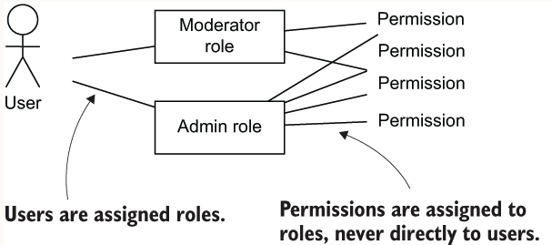

## Overview
ACLs are simple, but as the number of users and objects that can be accessed through an API grows, the number of ACL 
entries grows along with them. If you have a million users and a million objects, then in the worst case you could 
end up with a billion ACL entries listing the individual permissions of each user for each object. Though that approach 
can work with fewer users, it becomes more of a problem as the user base grows.

### LDAP groups
In many large organizations, including most companies, users are managed centrally in an LDAP (Lightweight Directory 
Access Protocol) directory. LDAP is designed for storing user information and has built-in support for groups. 
You can learn more about LDAP at https://ldap.com/basic-ldap-concepts/. 
  
### RBAC
Although groups can make managing large numbers of users simpler, they do not fully solve the difficulties of managing 
permissions for a complex API. First, almost all implementations of groups still allow permissions to be assigned to 
individual users as well as to groups. This means that to work out who has access to what, you still often need to 
examine the permissions for all users as well as the groups they belong to. Second, because groups are often used 
to organize users for a whole organization (such as in a central LDAP directory), they sometimes cannot be very 
useful distinctions for your API. For example, the LDAP directory might just have a group for all software engineers, 
but your API needs to distinguish between backend and frontend engineers, QA, and scrum masters.
  

  
### ABAC
Although RBAC is a very successful access control model that has been widely deployed, in many cases the desired access 
control policies cannot be expressed through simple role assignments.

To handle dynamic access control decisions, an alternative to RBAC has been developed known as ABAC: 
attribute-based access control. In ABAC, access control decisions are made dynamically for each API request 
using collections of attributes grouped into four categories.

When implementing ABAC, typically access control decisions are structured as a set of independent rules describing 
whether a request should be permitted or denied. If more than one rule matches a request, and they have different outcomes, 
then the question is which one should be preferred.

#### Implementing ABAC decisions